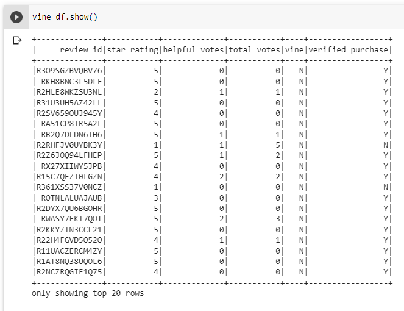
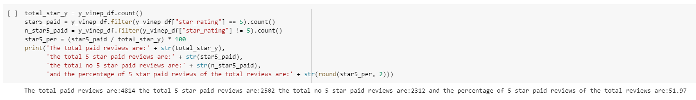
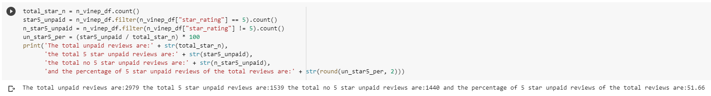
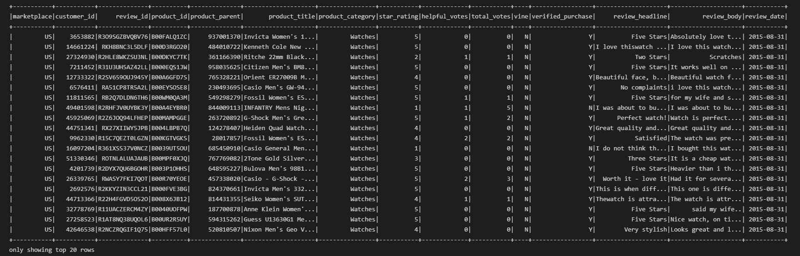

# Amazon Vine Analysis

## Overview of the analysis

The purpose of this project is to analyze Amazon reviews written by members of the paid Amazon Vine program. The Amazon Vine program is a service that allows manufacturers and publishers to receive reviews for their products. Companies pay a small fee to Amazon and provide products to Amazon Vine members, who are then required to publish a review.

I had access to approximately 50 datasets. But I specifically worked with the watches dataset and I performed the following steps:

**I** I used PySpark to perform the ETL process to extract the dataset, transform the data, connect to an AWS RDS instance, and load the transformed data into pgAdmin, how it is shown in the following image:

**II** Next, I used PySpark to determine if there was any bias toward favorable reviews from Vine members in your dataset. 

**III** Finally I wrote this summary of the analysis for Jennifer to submit to the SellBy stakeholders.

## Results

Using the results, we can answer the next questions:

`(a)` How many Vine reviews and non-Vine reviews were there?

Vine reviews: 4,814

Non-Vine reviews: 2,979

`(b)` How many Vine reviews were 5 stars? How many non-Vine reviews were 5 stars?

5 Stars Vine reviews: 2,502

5 stars Non-Vine reviews: 1,539

`(c)` What percentage of Vine reviews were 5 stars? What percentage of non-Vine reviews were 5 stars?

Percentage of 5 Stars Vine reviews: 51.97%

Percentage of 5 stars Non-Vine reviews: 51.66%

## Summary 

From the results achieved, we can conclude that:

**1.** The Vine reviews population is 61.5978% bigger than the non-Vine reviews population;

**2.** The 5-Stars Vine reviews population is 61.5107% bigger than the 5-Stars non-Vine reviews population;

**3.** So the non-5-Stars Vine reviews are 60.5555% bigger than the non-5-Stars non-Vine ones.

Apparently, there is a slight bias between the Vine and non-Vine reviews, so in the case of `watches` is not necessary that the companies pay Amazon to require customers to publish a review because, despite the population of the Vine reviews being bigger, the results are almost equal.

